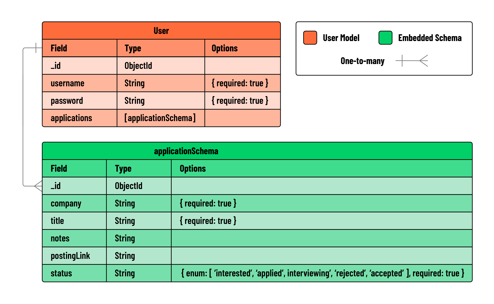

<h1>
  <span class="headline">Skyrockit</span>
  <span class="subhead">Build the Application Schema</span>
</h1>

**Learning objective:** By the end of this lesson, students will be able to define an `application` schema and embed it within the `user` model.

## Use the ERD as a guide

We already created an Entity Relationship Diagram (ERD) and decided to **embed** the `application` data inside the `user` model.

Embedding means we do **not** need to create a separate file for the application schema or connect it by importing or exporting between files. Instead, we define the `application` schema in the **same file** as the `user` schema and create the connection there.

Let’s begin by defining the `applicationSchema` and linking it to the `userSchema`.

In `models/user.js`, add the following code:

```javascript
// models/user.js

const applicationSchema = new mongoose.Schema({
  // properties of applications
});

const userSchema = new mongoose.Schema({
  username: {
    type: String,
    required: true,
  },
  password: {
    type: String,
    required: true,
  },
  applications: [applicationSchema], // embed applicationSchema here
});
```

Focus on the `applications` field inside `userSchema`. It is an **array of embedded application schemas**, which allows each user to store **multiple job applications**.

Notice that we defined `applicationSchema` **before** using it in `userSchema`. This order is important — the structure of the nested data must be created first.

## Define the structure of an application

Let’s think about our original user story:

> As a user, I want to be able to add new job applications that I'm thinking about applying to or have already applied to. For each job, I should be able to note down important information like the company's name, the job title, what stage the application is at, and if I want, some personal notes and the link to the job posting.

This user story tells us that each application should include:

- Company name
- Job title
- Status of the application
- Notes (optional)
- Link to the job posting (optional)

Let’s update our ERD with these fields:



Based on this, we can say that `"company"` and `"title"` should be **required**, while the rest are **optional**.

Note: MongoDB will automatically add an `_id` field to each embedded application, so we do **not** need to define it manually.

Now, let’s update the schema with the required fields:

```javascript
// models/user.js

const applicationSchema = new mongoose.Schema({
  company: {
    type: String,
    required: true,
  },
  title: {
    type: String,
    required: true,
  },
  notes: {
    type: String,
  },
  postingLink: {
    type: String,
  },
  status: {
    type: String,
    enum: ['interested', 'applied', 'interviewing', 'rejected', 'accepted'],
  },
});
```

That’s it! We have now completed the `applicationSchema` and embedded it inside the `user` model.
