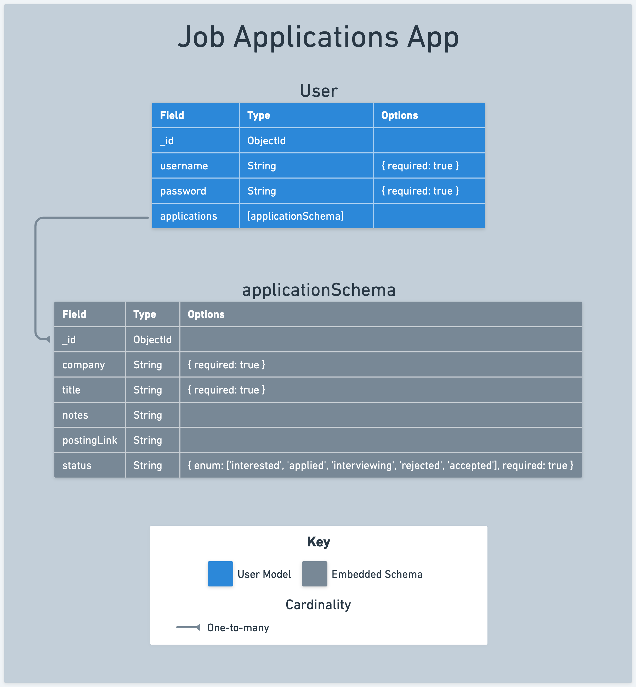

# 

**Learning objective:** By the end of this lesson, students will successfully develop an `application` schema and establish its relationship within the `user` model through embedding.

## Use the ERD as our guide.

We have established an ERD for our data and also decided to embed our application in the user model. Deciding to create an embedded relationship means that we will not need to create another file and import or export it's logic to other portions of our application.  Instead, we will define our schema logic in the same file that our user schema is located in and create the connection there.

Let's that process by defining our schema and associate it with the user.

In the `models/users.js`, we'll add the following logic:

```javascript
const applicationSchema = new mongoose.Schema({
  // properties of applications
});

const userSchema = new mongoose.Schema({
  username: {
    type: String,
    required: true,
  },
  password: {
    type: String,
    required: true,
  },
  applications: [applicationSchema], // embedding the applicationSchema here
});
```

Focus on the `applications` attribute within our `userSchema`. This key is associated with an array of `applicationSchema`. By doing this, we are structurally enabling a user to manage multiple job applications.

It's important to define and reference the `applicationSchema` before we detail what our applications data will look like. This order of operations is important for establishing the nested relationship between users and their applications first, and adding the details later. 

### Define the shape of our Applications

Now that we have defined our application schema let's think back to our first user story:

> As a user, I want to be able to add new job applications that I'm thinking about applying to or have already applied to. For each job, I should be able to note down important stuff like the company's name, the job title, what stage the application is at, and if I want, some personal notes and the link to the job posting.

This story let's us know that an application should have at least a "company name", "job title", "status", and "notes".  These are values that users can create and manage in the application. 

Let's add them to our ERD:



Considering our user story, it appears that "company" and "title" are essential fields, whereas other details are optional. Additionally, although our ERD includes an `_id`, there's no need to explicitly define it in our schema since MongoDB automatically generates this identifier when a new document is created.

With this knowledge in hand, we can return to the application schema and add the fields and types needed:

`models/users.js`
```javascript
const applicationSchema = new mongoose.Schema({
  company: {
    type: String,
    required: true,
  },
  title: {
    type: String,
    required: true,
  },
  notes: {
    type: String,
  },
  postingLink: {
    type: String,
  },
  status: {
    type: String,
    enum: ['interested', 'applied', 'interviewing', 'rejected', 'accepted'],
  },
});
```

With that, our applications schema is complete! 