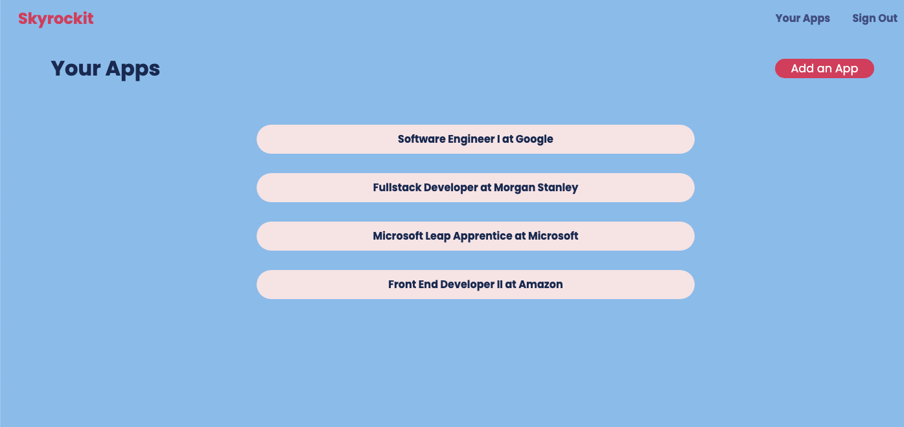
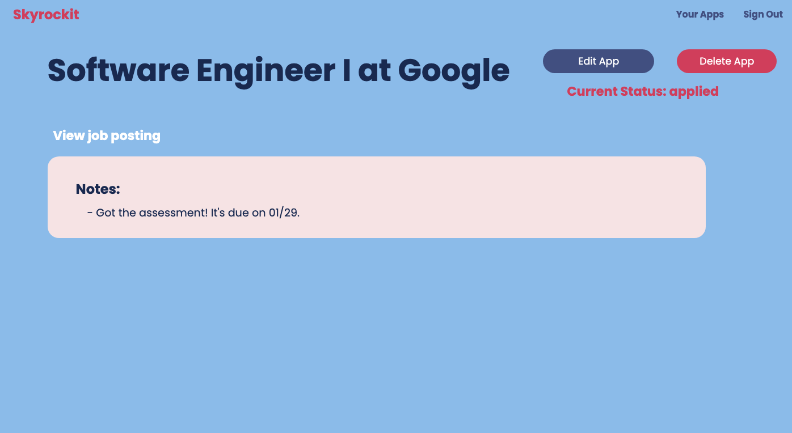

# ![[tktk Module Name] - Level Up - Style the Application](./assets/hero.png)

Now that you've built a MEN-stack app with embedding, it's time to add some style. If you follow all of the steps of this level up you'll have an app that looks like this:






## Setting up the middleware and static files

1. First we need to add our middleware so that our app can read and apply our css rules. Add the following code to `server.js`:
```javascript
app.use(express.urlencoded({ extended: false }));
app.use(methodOverride('_method'));
// app.use(morgan('dev'));

//new code below this line ----
app.use(express.static(path.join(__dirname, 'public')));
//new code above this line ---

app.use(
  session({
    secret: process.env.SESSION_SECRET,
    resave: false,
    saveUninitialized: true,
  })
);
```
The `express.static` middleware is designed to serve static files like CSS stylesheets.

2. Now we need to add require `path`, which we use in the `express.static` middleware. Add this to `server.js`:
```javascript
const port = process.env.PORT ? process.env.PORT : '3000';

//new code below this line ----
const path = require('path')

```

3. Next, we need to create a `public` folder. This is crucial because in the code above we designated the `public` directory as the one that will hold all of our static files for this app. Create the folder with this command:
```bash
mkdir public
```

4. Let's create a `stylesheets` folder inside our public folder:
```bash
mkdir public/stylesheets
```

5. Now we need to create a stylesheet called `style.css`, and link it at the top of all of most of our `views`. Create the stylesheet using this command:
```bash
touch public/stylesheets/style.css
```
and link it to the top of all of our `ejs` files except for `_navbar.ejs`:
```html
  <meta name="viewport" content="width=device-width, initial-scale=1.0" />

  // new code below this line ----
  <link rel="stylesheet" href="/stylesheets/style.css" />
```

## Applying general rules

We're going to set some basic rules for our whole app to achieve consistency. 

1. Import our Google Font at the top of `style.css`:
```css
@import url('https://fonts.googleapis.com/css2?family=Poppins:wght@400;600;700&display=swap');
```
This font is a great choice for our theme and branding because it's clean, simple, and modern looking.

>💡 Feel free to use whatever font you want here! If you want to deviate from the style we're working towards that's perfectly fine!

2. Add these rules to `style.css`:
```css
body {
  font-family: 'Poppins', sans-serif;
  display: flex;
  flex-direction: column;
  height: 100vh;
  width: 100vw;
  background-color: #9ac2ef;
}
```
Here, we're assigning the font that we imported, setting a common background color, and declaring the `<body>` element to be a `flexbox` with an orientation of `flex-direction: column`. 


## Styling the landing page 

**If you're logged into the app, you'll need to log out to see what we're changing in the next few sections.**

Most of the CSS we write is going to be recycled and used throughout the app, but a lot of what we're doing on the landing page will only be used once. To achieve this, we're going to add some `<divs>` and `classes` to our elements to make styling easier. 

1. First, in `index.ejs` we're going to add a class of `.index-body` to the `<body>` tag, as well as add four `<divs>`. Replace the code below the closing `</head>` tag with this:
```html
<body class="index-body">
  <%- include('./partials/_navbar.ejs') %>
    <div class="index-container">
      <div class="text-container">
        <h1 class="main-header">Skyrockit</h1>
        <p class="subheader">A job application tracker.</p>
      </div>
      <div class="auth-links">
        <a class="signup-link" href="/auth/sign-up">Sign Up</a>
        <a class="signin-link" href="/auth/sign-in">Sign In</a>
      </div>
    </div>
</body>
```

2. Now we're going to add our styling for the landing page. The following CSS is doing a few things:
- setting our background image and its size/positioning
- styling our header and subheader
- spacing out our elements with `flex`
- styling our buttons

Add these rules to `style.css`
```css
.index-body {
  background-image: url("https://img.freepik.com/free-photo/rocket-taking-off-boost-symbol-ai-generated-image_268835-6577.jpg");
  background-repeat: no-repeat;
  background-size: cover;
  min-height: 100vh;
  width: 100vw;
  color: white;
}

.main-header {
  font-weight: bold;
  color: white;
  font-size: 5.6em;
  margin: -160px 20px 0 20px;
}

.subheader {
  margin: 0 20px 0 20px;
  font-size: 1.4em;
}

.index-container {
  display: flex;
  flex-direction: row;
  justify-content: space-between;
  align-items: center;
  height: 100%;
}

.auth-links {
  display: flex;
  flex-direction: column;
  justify-content: center;
  align-items: center;
  margin: 0 80px 0 0;
  height: 100%;
}

.signup-link, .signin-link{
  text-decoration: none;
  font-size: 1.5em;
  padding: 8px 0;
  border-radius: 25px;
  width: 10em;
  text-align: center;
}

.signup-link {
  background-color: #ce4866;
  color: white;
  margin: 0 0 20px 0;
}

.signup-link:hover {
  background-color: #ff5378;
}

.signin-link {
  background-color: #f6e7e7;
  color: #1c2e5b;
  margin: 20px 0 0 0;
}

.signin-link:hover {
  background-color: #ffffff;
}
```


## Styling our partials

Since we're using partials (`_navbar.ejs`), we're going to give it its own stylesheet so we can keep those rules separate. It's important to note that we need to be very explicit with the rules we use for our partials, because they will also respond to the `style.css` stylesheet.

1. Create a stylesheet called `public/stylesheets/partials.css` and link to it in `_navbar.ejs`:
```html
<link rel="stylesheet" href="/stylesheets/partials.css" />
```

2. We want to make some small adjustments to our `_navbar.ejs` partial. Here are the changes we're making:
- add a `<div>` around each section of our `if... else` block
- add an `id` to our `<h1>`
- add `classes` to all other elements
```html
<nav>
  <% if(user) { %>
    <div class="navbar">
      <h1 id="nav-header">Skyrockit</h1>
      <div class="nav-links">
        <a class="authlink" href="/users/<%=user._id%>/applications">Your Apps</a>
        <a class="authlink" href="/auth/sign-out">Sign Out</a>
      </div>
    </div>
    <% } else { %>
      <div class="navbar">
        <h1 id="nav-header">Skyrockit</h1>
        <div class="nav-links">
          <a class="authlink" href="/auth/sign-in">Sign In</a>
          <a  class="authlink"href="/auth/sign-up">Sign Up</a>
        </div>
      </div>
      <% } %>
</nav>
```

3. Now we'll add the style to `partials.css`:
```css
.navbar {
  display: flex;
  flex-direction: row;
  max-width: 100vw;
  padding: 5px 20px;
  justify-content: space-between;
  align-items: center;
}

#nav-header {
  color: #ce4866;
  size: 1em !important;
  margin: 0;
}

.authlink {
  text-decoration: none;
  margin: 0 15px;
  color: #4b598e;
  font-weight: bold;
}

.authlink:hover {
  color: white;
}
```

## Styling our forms

1. We only need to do one thing on `sign-in.ejs` before styling: add a `<div>`:
```html
<body>
  <%- include('../partials/_navbar.ejs') %>
    <div class="signin-container">
      <h1>Sign in</h1>
      <form action="/auth/sign-in" method="POST">
        <label for="username">Username:</label>
        <input type="text" name="username" id="username" />
        <label for="password">Password:</label>
        <input type="password" name="password" id="password" />
        <button type="submit">Sign in</button>
      </form>
    </div>
</body>
```

2. We'll do the same thing for `sign-up.ejs` before adding styles:
```html
<body>
  <%- include('../partials/_navbar.ejs') %>

    <div class="signup-container">
      <h1>Create a new account!</h1>
      <form action="/auth/sign-up" method="POST">
        <label for="username">Username:</label>
        <input type="text" name="username" id="username" />
        <label for="password">Password:</label>
        <input type="password" name="password" id="password" />
        <label for="confirmPassword">Confirm Password:</label>
        <input type="password" name="confirmPassword" id="confirmPassword" />
        <button type="submit">Sign up</button>
      </form>
    </div>
</body>
```

3. Now, we'll add style rules for the form containers, and add styling for small things like form input bars, the submit button, and so on. You'll see that we're defining colors here, but again feel free to make it your own and change things up!

Add the following to `style.css`:
```css
.signin-container, .signup-container {
  display: flex;
  flex-direction: column;
  justify-content: center;
  align-items: center;
  width: 100%;
  height: 100%;
}

h1 {
  color: #1c2e5b;
}

form {
  display: flex;
  flex-direction: column;
  justify-content: space-evenly;
  width: 20em;
  height: 50%;
  background-color: #f6e7e7;
  padding: 30px 40px 20px 40px;
  border-radius: 20px;
  color: #4b598e;
  font-weight: bold;
}

input {
  border: 1px solid rgb(182, 182, 182);
  padding: 8px;
  border-radius: 10px;
}

button{
  padding: 10px;
  background-color: #ce4866;
  color: white;
  border-radius: 30px;
  border: none;
  margin: 15px 0;
  font-size: 1.1em;
}
```

## Styling the index page

Now that we've added all the styles to the landing page, the sign in form, and the sign up form, it's time to log into the app so we can style the rest. 

1. We're going to add some `classes` and `<divs>` to the contents of `applications/index.ejs`:
```html
      <div class="all-apps-body">
      <div class="all-apps-header">
        <h1>Your Apps</h1>
        <a class="add-app-link" href="/users/<%=user._id%>/applications/new">Add an App</a>
      </div>
      <ul>
        <% applications.forEach((application)=>{ %>
          <a href="/users/<%= user._id %>/applications/<%= application._id %>">
            <li>
              <%= application.title %> at <%= application.company %>
            </li>
          </a>
          <% }) %>
      </ul>
    </div>
```

1. Add the style rules to `style.css`. These will help adjust the layout of the page and add some style to our "Add an App" link.
```css
.all-apps-body {
  display: flex;
  flex-direction: column;
  align-items: center;
  justify-content: center;
}

.all-apps-header {
  display: flex;
  flex-direction: row;
  justify-content: space-between;
  align-items: center;
  padding: 10px 20px;
  width: 90%;
}

.add-app-link {
  padding: 10px;
  background-color: #ce4866;
  color: white;
  border-radius: 30px;
  border: none;
  font-size: 1.1em;
  padding: 2px 25px;
  text-decoration: none;
}

.add-app-link:hover{
  background-color: #e84a6c;
}
```

3.  Next we'll add some rules to style the `<li>` elements, also known as our application cards. Add the following to `style.css`:
```css
ul {
  list-style: none;
  width: 90%;
  display: flex;
  flex-direction: column;
  justify-content: center;
  align-items: center;
}

ul>a {
  text-decoration: none;
  color:#1c2e5b;
  width: 50%;
  background-color: #f6e7e7;
  border-radius: 30px;
  padding: 10px 20px;
  margin: 15px 0;
  font-weight: bold;
  text-align: center;
}

ul>a:hover {
  background-color: #4b598e;
  color: white;
}
```

## Styling the show page

Now onto the show page. The layout we're working towards for this page is a bit more complicated, so we're going to create a new stylesheet to use just for this page. That way we don't have to spend extra time trying to undo some of the rules we've already set in `style.css` that conflict with what we want. 

1. Create a new stylesheet called `public/stylesheets/show.css` and replace the link for `style.css` in `applications/show.ejs`:
```html
  <link rel="stylesheet" href="/stylesheets/show.css" />
```

2. We also want to make a few adjustments to the structure of our content. We'll be adding several `<divs>` and some `classes` as well. Replace the contents of `show.ejs` with this:
```html
<body>
  <%- include('../partials/_navbar.ejs') %>
    <div class="show-body">
      <div class="show-header">
        <h1>
          <%= application.title %> at <%= application.company %>
        </h1>
        <div class="show-sidebar">
          <div class="show-actions">
            <a href="/users/<%= user._id %>/applications/<%= application._id %>/edit">
              Edit App
            </a>
            <form action="/users/<%= user._id %>/applications/<%= application._id %>?_method=DELETE" method="POST">
              <button type="submit">Delete App</button>
            </form>
          </div>
          <p>Current Status: <%= application.status %>
          </p>
        </div>
      </div>
      <div class="show-notes-container">
        <% if (application.postingLink) { %>
          <a href="<%= application.postingLink %>" target="_blank">View job posting</a>
          <% } %>
            <% if (application.notes) { %>
              <div class="show-notes">
                <h2>Notes:</h2>
                <p>
                  <%= application.notes %>
                </p>
              </div>
              <% } %>
      </div>
    </div>
</body>
``` 

3.  Add the following style rules to `show.css`. You'll notice that we need to re-import our font, as well as copy over the `body` rules from `style.css`:
```css
@import url('https://fonts.googleapis.com/css2?family=Poppins:wght@400;600;700&display=swap');


body {
  display: flex;
  flex-direction: column;
  height: 100vh;
  width: 100vw;
  background-color: #9ac2ef;
}

.show-body {
  display: flex;
  flex-direction: column;
  width: 100%;
  justify-content: center;
  align-items: center;
}


.show-header {
  display: flex;
  flex-direction: row;
  justify-content: space-between;
  align-items: center;
  width: 90%;
}

.show-header>h1 {
  color: #1c2e5b;
  font-size: 3.4em;
  margin-left: 10px;
}

.show-actions {
  display: flex;
  flex-direction: row;
  width: 100%;
  justify-content: space-between;
  align-items: center;
  margin: 20px 0 0 30px;
}

button {
  padding: 8px 10px;
  background-color: #ce4866;
  color: white;
  border-radius: 30px;
  border: none;
  font-size: 1.1em;
  width: 10em;
  margin: 5px;
}

button:hover{
  background-color: #e84a6c;
}

.show-actions>a {
  background-color: #4b598e;
  color: white;
  text-decoration: none;
  font-size: 1.1em;
  padding: 8px 10px;
  border-radius: 30px;
  width: 10em;
  text-align: center;
  margin: 5px;
  font-family: 'Poppins', sans-serif;
}

.show-actions>a:hover {
  background-color: #1c2e5b;
}

p {
  color: #ce4866;
  font-weight: bold;
  font-size: 1.4em;
  margin: 10px 30px;
  text-align: center;
}

.show-notes-container {
  width: 90%;
  margin: 20px 0;
}

.show-notes-container>a {
  text-decoration: none;
  font-weight: bold;
  color: white;
  font-size: 1.4em;
  margin: 20px;  
}

.show-notes-container>a:hover {
  color:#4b598e
}

.show-notes {
  background-color: #f6e7e7;
  width: 85%;
  border-radius: 20px;
  padding: 40px 40px 20px 40px;
  margin: 20px 10px;
}

h2 {
  margin: 0 10px;
  color: #1c2e5b;
}

.show-notes>p{
  font-weight:normal;
  color: #1c2e5b;;
  text-align: left;
  font-size: 1.2em;
}
```

## Styling the `new` and `edit` forms

We're in the home stretch! Now we just need to fix some small things on our `applications/new.ejs` and `applications/edit.ejs` pages. 

1. First, let's work in `applications/new.ejs`. Add a `<div>` around the `form` and give it a class of `.new-body`:
```html
<div class="new-body">
   <form action="/users/<%= user._id %>/applications" method="POST">
   ...
   </form>
</div>
```

2. Do the same for `applications/edit.ejs`, but with the classname of `.edit-body`:
```html
<div class="edit-body">
  <h1>Edit <%= application.title %> at <%= application.company %>
  </h1>
    <form action="/users/<%= user._id %>/applications/<%= application._id %>?_method=PUT" method="POST">
    ...
    </form>
</div>
```

3.  Add some css for those pages in `style.css` (notice we're back to working in `style.css`!):
```css
.new-body {
  display: flex;
  justify-content: center;
  align-items: center;
  height: 100%;
}

.new-body>form, .edit-body>form {
  height: 70%;
}

textarea, select {
  border: 1px solid rgb(182, 182, 182);
  border-radius: 10px;
  padding: 10px;
}

select {
  margin-bottom: 10px;
}

.edit-body {
  display: flex;
  flex-direction: column;
  justify-content: center;
  align-items: center;
  height: 100%;
}
```

That's it! Congrats on fully styling your app!
